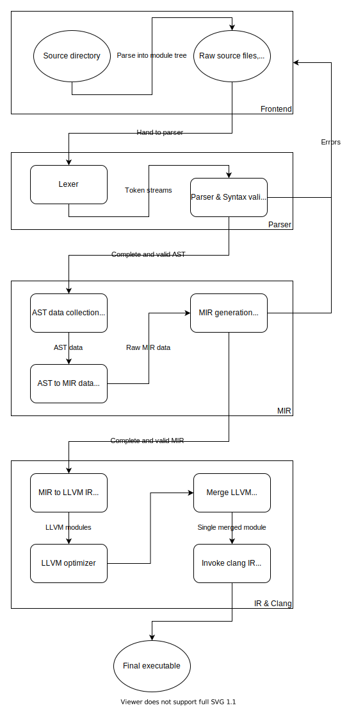

# Compiler Structure

This optional chapter gives a short overview of the `gelixrs` compiler
and how it works. If you only intend to use gelix and do not want to 
contribute, you can ignore this chapter.

## Basic Structure 

This diagram gives a basic idea of how the compiler is structured:

While this diagram is quite complicated, the basic structure is simply this:

- First, build a tree of raw source files from the given input
- Then parse each file into an AST, reporting any syntax errors
- Convert the AST to MIR (Middle Intermediate Representation) using
a pass-based generator, reporting any semantic errors
- Use this error-free MIR and create LLVM IR that is then compiled by `clang`.

The majority of the compiler's complexity lies in the MIR generator, as it has to compile 
the AST into MIR.

MIR is fully typed and uses a reduced instruction/expression set than the AST,
to help ease IR transition. It also instances generic types into concrete types
and does all other type system tasks, to ensure the program is sound.

The IR generator simply takes the MIR and compiles it to IR, with no 
checks or similar performed; the only task also performed by this step
is to generate GC instructions for SRs.